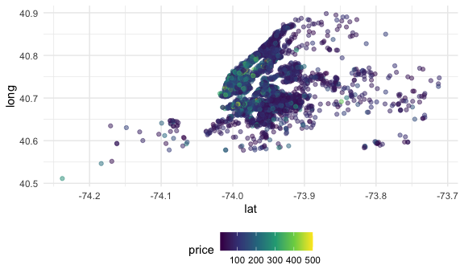

case study
================

``` r
library(tidyverse)
library(p8105.datasets)

knitr::opts_chunk$set(
  fig.width = 6,
  fig.asp = .6,
  out.width = "90%"
)

theme_set(theme_minimal() + theme(legend.position = "bottom"))

options(
  ggplot2.continuous.colour = "viridis",
  ggplot2.continuous.fill = "viridis"
)

scale_colour_discrete = scale_colour_viridis_d
scale_fill_discrete = scale_fill_viridis_d
```

## Load the datasets

``` r
data(nyc_airbnb)
```

-   How many rentals are there? Of what type? In what places?
-   Is price correlated with review score?
-   Which neighborhood is most popular? Most expensive?
-   Which neighborhood has the highest reviews?

Let’s look at price and room type…

Pirce and neighborhood

``` r
nyc_airbnb %>% 
  group_by(neighbourhood) %>% 
  summarize(mean_price = mean(price, na.rm = TRUE)) %>% 
  arrange(mean_price)
```

    ## # A tibble: 217 × 2
    ##    neighbourhood     mean_price
    ##    <chr>                  <dbl>
    ##  1 Little Neck             41.7
    ##  2 Schuylerville           42.6
    ##  3 Morris Heights          47.6
    ##  4 Mount Eden              49.3
    ##  5 Soundview               50.6
    ##  6 Claremont Village       51.6
    ##  7 Hunts Point             52.2
    ##  8 Baychester              54  
    ##  9 Rosebank                55  
    ## 10 Belmont                 55.4
    ## # … with 207 more rows

``` r
nyc_airbnb %>% 
  filter(neighbourhood_group == "Manhattan",
         price <= 1000) %>%
  mutate(neighbourhood = 
           fct_reorder(neighbourhood, price)) %>% 
  ggplot(aes(x = neighbourhood, y = price)) + 
  geom_boxplot() + 
  coord_flip() + 
  facet_grid(. ~ room_type)
```


Price vb location

``` r
nyc_airbnb %>% 
  filter(price <= 500) %>% 
  sample_n(5000) %>% 
  ggplot(aes(x = lat, y = long, color = price)) + 
  geom_point(alpha = .5)
```



## retry
